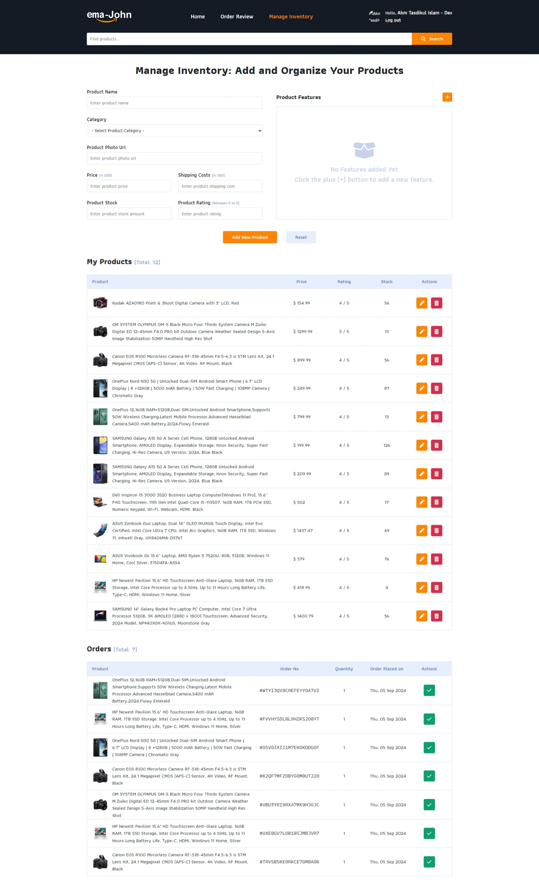
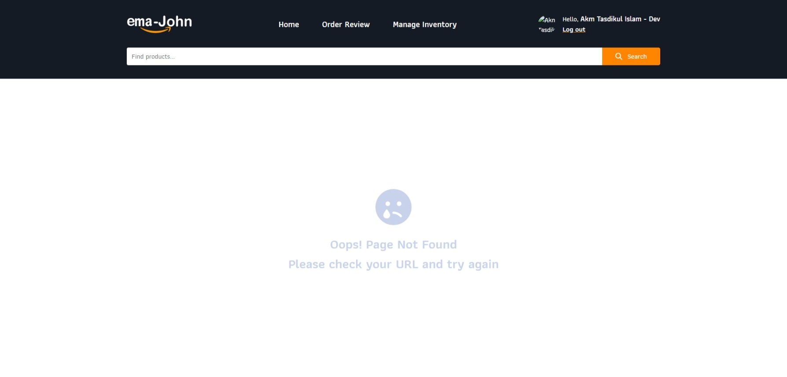

# Ema-John E-Commerce Project

## Table of Contents

1. [Introduction](#introduction)
2. [Features](#features)
3. [Technologies Used](#technologies-used)
4. [Project Structure](#project-structure)
5. [Pages](#pages)
6. [Author](#author)
7. [License](#license)

## Introduction

Ema-John is a comprehensive e-commerce platform built with React. It provides a seamless shopping experience with features like product browsing, cart management, user authentication, and order processing.

## Features

- User authentication (including Google Sign-In)
- Product catalog browsing
- Shopping cart functionality
- Order placement and management
- Inventory management for administrators
- Responsive design for various devices

## Technologies Used

- React
- React Router
- Firebase (Authentication and Realtime Database)
- CSS for styling
- Service Worker for offline capabilities

## Project Structure

ema-john/
├── public/
│ ├── index.html
│ └── service-worker.js
├── src/
│ ├── components/
│ ├── pages/
│ ├── services/
│ ├── utils/
│ ├── App.js
│ ├── index.js
│ └── serviceWorker.js
├── package.json
├── README.md
└── .gitignore

This structure reflects a typical React application created with Create React App, which is implied by the presence of the serviceWorker.js file. The project likely includes:

1. A `public` folder for static assets
2. A `src` folder for the main application code
3. Component and page folders for organizing React components
4. A services folder for API calls or other services
5. A utils folder for utility functions
6. Main App.js and index.js files
7. The serviceWorker.js file for offline capabilities
8. Standard configuration files like package.json and .gitignore

## Pages

### Home

The landing page of the application, showcasing featured products.

### Inventory

An admin page for managing product inventory.

### Login

Handles user authentication, including email/password and Google sign-in options.

### NotFound

A 404 error page for invalid routes.

### OrderReview

Allows users to review their current order before checkout.

### Checkout

Processes the final order and collects shipping information.

### SignUp

Allows users to create a new account.

## Author

- [Akm Tasdikul Islam](https://github.com/akmtasdikul)

## License

This project is licensed under the MIT License.
